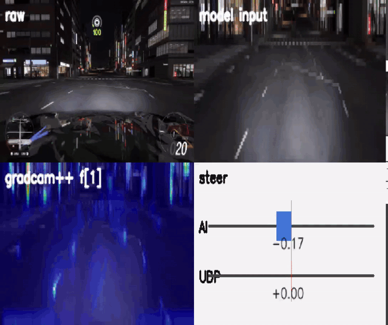
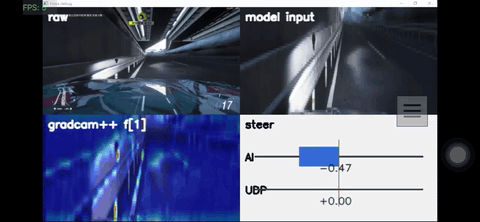
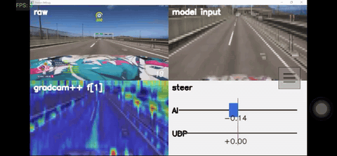
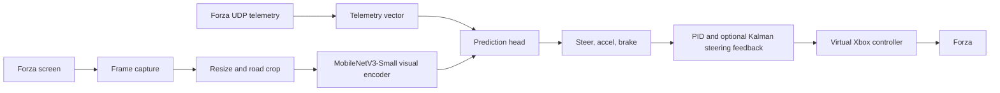

# End2End Autodrive Image-Steer

[](https://github.com/ricky5932TW/End2End-autodrive-image-steer/stargazers)


[中文](README.zh-TW.md)

Image-to-steering imitation learning for Forza: collect driving data quickly in a rich game environment, train an end-to-end visual controller, and run it live through a virtual Xbox controller with telemetry feedback.

<p align="center">
  <a href="docs/assets/live-debug.mp4">
    
  </a>
</p>

<p align="center">
  <a href="docs/assets/live-debug.mp4">Open the 9s live debug MP4</a>
</p>

## 🎮 Why Games

Real autonomous-driving data is expensive to collect, hard to label, and difficult to repeat under controlled conditions. Racing games offer a practical academic sandbox: dense visual scenes, changing lighting, track geometry, tire limits, telemetry, and fast resets.

This project uses racing-game data for supervised end-to-end driving, with faster, safer, and more repeatable data collection while preserving enough control complexity to study image-to-action policies.

Sony AI's GT Sophy is a strong motivation for taking racing games seriously as research environments: the Nature paper shows deep reinforcement learning agents trained in Gran Turismo can handle non-linear race-car control and multi-agent tactics at champion level. This repo explores a smaller related question: how far can a practical image-steering pipeline go when the game is used as the data engine?

## 🧭 Research Lineage

| Year | Work | Why it matters here |
| --- | --- | --- |
| 1984 | CMU Navlab | The Navlab program established a long-running line of camera-based autonomous and assisted driving research. |
| 2004 | DAVE | A small off-road robot used camera input and end-to-end learning to predict steering from human driving. |
| 2016 | NVIDIA End to End Learning for Self-Driving Cars | A CNN mapped raw front-camera pixels directly to steering, and the authors reported that the network learned useful road features without explicit road-outline labels. |
| 2022 | Sony AI GT Sophy | Deep RL in Gran Turismo showed that racing games can support high-performance control research in complex, rule-constrained environments. |
| 2026 | This repo | Forza is used as a fast data-collection and evaluation loop for end-to-end image steering. |

## 🎞️ Demo Clips

These are curated, muted, GitHub-safe clips generated from local recordings. The GIF previews render inline on GitHub; click a preview or MP4 link to open the original clip. Raw videos remain ignored in `media/`.

| Live Debug | Long Run | Short Control |
| --- | --- | --- |
| <a href="docs/assets/live-debug.mp4"></a> | <a href="docs/assets/long-run.mp4"></a> | <a href="docs/assets/short-control.mp4"></a> |
| [Open MP4](docs/assets/live-debug.mp4) | [Open MP4](docs/assets/long-run.mp4) | [Open MP4](docs/assets/short-control.mp4) |

## 🧩 System Overview



The runtime captures the game screen, applies the same crop and ImageNet normalization used in training, fuses visual features with telemetry when the checkpoint expects it, and sends steering commands through `vgamepad`. A live debug window shows the raw frame, model input, Grad-CAM++ overlay, and AI-vs-UDP steering bars.

Runtime steering uses a feedback-control loop. The model predicts a normalized steering target. The virtual Xbox stick has a small deadzone, the game applies its own input response curve, and vehicle dynamics vary across speed, grip, tire slip, and track surface. A small visual model can also jitter or under-correct outside its familiar data distribution. The live loop can scale the model target with `--steer-scale`, smooth the actual stick command, zero tiny commands through the controller deadzone, and use PID feedback against Forza UDP `Steer`. Optional Kalman filtering makes that UDP measurement less noisy before PID correction. PID/Kalman form the control layer between the imitation model and a playable closed-loop controller.

Core implementation:

- `forza_autodrive/drive.py`: live inference loop, debug window, hotkeys, controller output
- `forza_autodrive/model.py`: MobileNetV3-Small backbone with a steering head
- `forza_autodrive/preprocess.py`: capture, resize, crop, normalization
- `forza_autodrive/telemetry.py`: Forza Dash UDP parser
- `forza_autodrive/controller.py`: virtual Xbox output, steering deadzone, and command smoothing
- `forza_autodrive/steering_control.py`: PID correction, correction limiting, rate limiting, and optional scalar Kalman filtering
- `load_data.ipynb`: training, validation plots, prediction inspection, and Grad-CAM/Score-CAM analysis

## 🧪 Training, Augmentation, and Resampling

The training notebook is organized around one practical problem: most collected driving frames are easy straight or low-steering moments, while the model needs enough left turns, right turns, recoveries, and high-curvature examples to stay useful at runtime.

The recorded sessions use racing-line driving and include competitor cars. Cornering labels often favor clipping apexes, using track-side braking or turn-in markers, and following a lead car across repeated laps. This data distribution can produce unstable steering in live runs, including sudden large-angle corrections when the model locks onto an apex, marker, or nearby car.

<p align="center">
  
</p>

Dataset and preprocessing:

- 8 recorded sessions are loaded from `dataset.csv` files.
- 96,182 raw rows become 72,942 valid moving rows after `Speed > 0` and `is_valid == 1` filtering.
- Steering labels are smoothed with an EMA filter using `alpha=0.70`.
- Data is split 90/10 for training and validation with a fixed seed.
- Images are resized and cropped to the road-focused box `(0, 75, 320, 122)`, then ImageNet-normalized.

Training augmentation keeps the visual policy from memorizing one narrow capture distribution. The dataset applies horizontal flips with steering sign inversion, brightness/contrast jitter, small rotation and affine translation/scale, grayscale, invert, posterize, solarize, sharpness, autocontrast, equalize, random erasing, and Gaussian noise.

<p align="center">
  
</p>

The custom `StdOutlierActionBatchSampler` marks rows whose action values are more than `3 std` from the train-set mean. These rows make up 7.7% of the train split (`5,060 / 65,648`). Each 1,024-sample training batch deliberately draws 512 rows from that high-action group, increasing the frequency of left/right corrections and curves compared with uniform sampling.

Loss setup:

The active objective is a steering-only weighted MSE. The notebook currently computes:

```text
steer_loss = mean((pred_steer - target_steer)^2 * weight)
weight = 1 + max(log(abs(target_steer)), 0.01)
```

The `weight` multiplier is applied to squared steering error. Near-zero `target_steer` values use a floor, so the minimum multiplier is `1.01x` and straight-driving examples still contribute loss. As the absolute steering target increases, mistakes on turns and large corrections become more expensive: `abs(target_steer)=10` is about `3.30x`, `64` is about `5.16x`, and `127` is about `5.84x`.

<p align="center">
  
</p>

The current checkpoint path trains a MobileNetV3-Small visual backbone with AdamW, warmup, cosine restarts, and early stopping. Train/validation total loss, early stopping, and best-checkpoint selection all use steering loss. `accel=0.5` and `brake=0.0` are placeholder outputs in the current steering-only path because accel and brake behavior are not trained yet; the notebook keeps `accel_loss` / `brake_loss` MSE code in place, but it is currently commented out.

Comparison with NVIDIA DAVE-2 / end-to-end driving:

| Aspect | Same idea | This repo's implementation |
| --- | --- | --- |
| Supervision | Learn steering from pixels and human/driver commands. | Learn steering from Forza screen captures and recorded controller/telemetry labels. |
| Preprocessing | Use road-focused visual input from the camera frame. | Crop the game frame to the lower road band and normalize with ImageNet statistics. |
| Augmentation | NVIDIA used recovery-style augmentation with shifted/rotated views and corrected steering labels. | This repo uses image augmentations plus horizontal flip with steering sign inversion. |
| Imbalance | Curves and recovery cases need extra attention because straight driving dominates raw data. | Rare action rows above `3 std` are boosted from 7.7% of training rows to 50% of each batch. |
| Vehicle interface | NVIDIA collected real-road steering through CAN bus and used `1/r` turning curvature as the target. | This repo uses Forza data, filtered steering labels, game telemetry, PID/Kalman feedback, and a virtual Xbox controller. |

For NVIDIA's original training and architecture figures, see the [paper](https://arxiv.org/abs/1604.07316) and [PDF](https://images.nvidia.com/content/tegra/automotive/images/2016/solutions/pdf/end-to-end-dl-using-px.pdf). The diagrams in this README are generated from this repo's notebook statistics.

## 🔎 Interpretability

The notebook includes Score-CAM/Grad-CAM style checks for the trained steering model.

Final-layer attention is broad and decision-level:

<p align="center">
  
</p>

Shallow-layer attention is more local and repeatedly lights up road texture, lane markings, guardrails, and track boundaries:

<p align="center">
  
</p>

This qualitatively echoes the NVIDIA end-to-end driving paper: with steering supervision alone, a CNN can learn internal road features from driving data. In this repo, the observation is a sanity check for what the Forza model appears to attend to.

## 💻 Quick Start

### 1. Runtime setup

Install the runtime dependencies in your Python environment.

> [!NOTE]
> Choose the PyTorch wheel for your local CUDA or CPU setup; the command below is the simple pip form used as a starting point.

```powershell
py -m pip install torch torchvision numpy pillow opencv-python dxcam keyboard vgamepad pytorch-grad-cam
```

For live control on Windows, install or repair the ViGEmBus driver so `vgamepad` can create a virtual Xbox 360 controller.

### 2. Place model weights

The checkpoint is intentionally ignored because it is larger than GitHub's normal file limit. Put your local checkpoint at:

```text
best_model.pth
```

### 3. Enable Forza telemetry

In Forza, enable Data Out with Dash format and send UDP packets to this machine:

```text
Host: 127.0.0.1 or your PC IP
Port: 9999
Format: Dash
```

### 4. Dry-run first

This runs inference and the debug window without touching the virtual controller.

```powershell
py -m forza_autodrive.drive --model best_model.pth --no-controller --debug-window
```

### 5. Live driving

> [!CAUTION]
> Before arming live control, verify telemetry is updating, the Forza window is focused, the virtual controller state is understood, and `F8` emergency stop works.

```powershell
py -m forza_autodrive.drive --model best_model.pth --start-armed
```

Hotkeys:

- `F9`: arm or disarm AI control
- `F8`: emergency stop
- `Ctrl+C`: exit and reset controller

Useful options:

```powershell
py -m forza_autodrive.drive --steer-scale 2.0 --steer-feedback pid --steer-kalman --fps 30
```

Steering feedback tuning starts with `--steer-scale`, because the model target and in-game stick response have a nonlinear mapping. If the car ignores small corrections, scale may be too low or the command may be inside the gamepad/game deadzone. If it oscillates, lower `--steer-scale`, lower PID gains, reduce `--steer-pid-correction-limit`, or enable `--steer-kalman` so PID follows a less noisy UDP steering measurement. `--steer-smoothing` and `--steer-pid-correction-rate-limit` are useful when the model is visually correct on average while too twitchy frame to frame.

## 📦 README Asset Workflow

The raw recordings in `media/` and model checkpoints are intentionally ignored. Publish only compact README assets:

```powershell
py -m pip install -r requirements-readme-assets.txt
py tools/export_readme_assets.py
```

The exporter:

- cuts short muted clips from `media/`
- trims the selected segment tails and avoids the final second of every source recording
- targets MP4 files under 10 MiB
- exports poster JPGs under 500 KiB
- extracts compact Score-CAM montages from `load_data.ipynb`

GitHub warns above 50 MiB and blocks files above 100 MiB in regular Git repositories, so `media/` and `*.pth` stay local unless they are published through Releases or Git LFS.

## 📚 References

- [CMU Navlab](https://www.cs.cmu.edu/afs/cs/project/alv/www/)
- [DAVE: Autonomous Off-Road Vehicle Control using End-to-End Learning](https://cs.nyu.edu/~yann/research/dave/)
- [NVIDIA: End to End Learning for Self-Driving Cars](https://arxiv.org/abs/1604.07316)
- [NVIDIA paper PDF](https://images.nvidia.com/content/tegra/automotive/images/2016/solutions/pdf/end-to-end-dl-using-px.pdf)
- [Sony AI GT Sophy announcement](https://ai.sony/news/sonyai009)
- [Nature: Outracing champion Gran Turismo drivers with deep reinforcement learning](https://www.nature.com/articles/s41586-021-04357-7)
- [GitHub Docs: About large files on GitHub](https://docs.github.com/en/repositories/working-with-files/managing-large-files/about-large-files-on-github)
