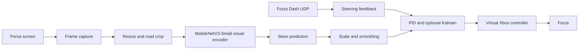

# End2End Autodrive Image-Steer

[](https://github.com/ricky5932TW/End2End-autodrive-image-steer/stargazers)


[繁體中文 README](README.zh-TW.md)

This is an image-to-steering imitation learning project that uses Forza as the data collection and evaluation environment. It trains an end-to-end visual steering model from game frames and driving labels, then runs live control through a virtual Xbox controller, Forza Dash UDP telemetry, PID feedback, and optional Kalman filtering.

This README reflects the replanned dataset and the current retraining notebook. The previous README and old assets remain under `old/` as an archive; the current public docs only link to the repository root and `docs/assets/`.

<p align="center">
  <a href="docs/assets/demo-freeway.mp4">
    
  </a>
</p>

<p align="center">
  <a href="docs/assets/demo-freeway.mp4">Open freeway demo MP4</a>
</p>

## Why Games

Real-world autonomous driving data is expensive, hard to label, and difficult to replay under identical conditions. Racing games are a practical research sandbox: rich visual scenes, lighting variation, track geometry, tire limits, telemetry, and fast reset loops.

This project uses Forza for supervised end-to-end driving. The goal is not to claim real-road autonomy, but to build a repeatable image-to-action policy pipeline with enough control complexity to be interesting. Sony AI's GT Sophy is a key motivation: Gran Turismo showed that racing games can support high-performance control research. This repo explores a smaller and more practical question: how far can a usable image-to-steering pipeline go when the game is the data engine?

## Research Context

| Year | Work | Connection to this project |
| --- | --- | --- |
| 1984 | CMU Navlab | Early camera-based automated and assisted driving research. |
| 2004 | DAVE | A small off-road robot learned steering from camera inputs and human driving data. |
| 2016 | NVIDIA End to End Learning for Self-Driving Cars | A CNN predicted steering directly from front-camera raw pixels; this repo follows the same supervised image-to-steering idea. |
| 2022 | Sony AI GT Sophy | Deep reinforcement learning in Gran Turismo showed that racing games can support complex control research. |
| 2026 | This repo | Forza is used for data collection, resampled training, visual inspection, and live control evaluation. |

## Demos

These GitHub-safe silent clips are exported from the current recordings in `media/`. GIF previews render directly in the README; click a thumbnail or MP4 link to open the clip.

| Freeway | Mountain | Unpaved |
| --- | --- | --- |
| <a href="docs/assets/demo-freeway.mp4"></a> | <a href="docs/assets/demo-mountain.mp4"></a> | <a href="docs/assets/demo-unpaved.mp4"></a> |
| [Open MP4](docs/assets/demo-freeway.mp4) | [Open MP4](docs/assets/demo-mountain.mp4) | [Open MP4](docs/assets/demo-unpaved.mp4) |

| Night | Long range |
| --- | --- |
| <a href="docs/assets/demo-night.mp4"></a> | <a href="docs/assets/demo-longrange.mp4"></a> |
| [Open MP4](docs/assets/demo-night.mp4) | [Open MP4](docs/assets/demo-longrange.mp4) |

## Architecture



At runtime, the app captures the game screen and applies the same resize, road crop, and ImageNet normalization used during training. The current checkpoint is an image-only steering model, with `telemetry_dim=0` in the notebook. Forza UDP is still used for live status, speed and packet checks, and PID feedback from UDP `Steer`.

Core files:

- `training_data.py`: session discovery, `dataset.csv` loading, valid moving row filtering, and steering EMA.
- `load_data.ipynb`: dataset planning, augmentation, balanced sampling, training, loss plots, and CAM checks.
- `forza_autodrive/model.py`: MobileNetV3-Small visual backbone and steering head.
- `forza_autodrive/preprocess.py`: capture, resize, crop, and normalization.
- `forza_autodrive/drive.py`: live inference loop, debug window, hotkeys, and controller output.
- `forza_autodrive/telemetry.py`: Forza Dash UDP parser.
- `forza_autodrive/controller.py`: virtual Xbox output, deadzone handling, and smoothing.
- `forza_autodrive/steering_control.py`: PID correction, rate limiting, and optional scalar Kalman filtering.

## Training, Augmentation, And Resampling

The current notebook replans the dataset around `sessions/`, replacing the old data distribution with newer driving clips and changing rare-action sampling so the model sees more corrections, turns, and high-action examples.

<p align="center">
  
</p>

Dataset and preprocessing:

- 12 image sessions are loaded from `dataset.csv` files under `sessions/`.
- 52,697 raw rows become 52,015 valid moving rows after `Speed > 0` and `is_valid == 1`.
- Steering labels use EMA smoothing with `alpha=0.70`; the saved notebook output reports mean `|delta|=0.503`, raw std `13.335`, and filtered std `12.972`.
- A fixed-seed 90/10 split produces 46,814 train rows and 5,201 validation rows.
- Images are resized to 320x180, then cropped to the road band `(0,75,320,122)`, producing a `3x47x320` input tensor.
- The current training path is image-only: `TELEMETRY_COLUMNS=()` and `telemetry_dim=0`.

Augmentation is meant to keep the visual policy from memorizing one recording distribution. The dataset applies horizontal flip with steering sign inversion, brightness and contrast jitter, small rotation, affine translation and scale, grayscale, invert, posterize, solarize, sharpness, autocontrast, equalize, random erasing, and Gaussian noise.

<p align="center">
  
</p>

`StdOutlierActionBatchSampler` marks a row as an outlier when any action value is more than `1 std` away from the train-set mean. These rows are 16.2% of the train split (`7,583 / 46,814`), but each 1,024-row training batch intentionally draws 512 rows from the outlier group. This keeps turns, corrections, and stronger throttle/brake changes from being drowned out by stable cruising frames.

The active objective is steering-only weighted MSE:

```text
steer_loss = mean((pred_steer - target_steer)^2 * weight)
weight = 10 ** (abs(target_steer) / 127)
```

The multiplier is `1.00x` near zero steering and rises to `10.00x` at full steering `127`. Compared with the older log-weight approach, this version more directly raises the cost of missing large steering targets.

<p align="center">
  
</p>

The model uses a MobileNetV3-Small backbone, AdaptiveAvgPool2d `(4,12)`, a 1024-unit head, LayerNorm, SiLU, Dropout, and a `tanh` steering output scaled to `[-127,127]`. Optimization uses AdamW, warmup, CosineAnnealingWarmRestarts, and early stopping. The saved notebook shows training was manually interrupted around epoch 477; the best visible validation steering loss is `72.8778` at epoch 476, so this README treats the checkpoint as the current state rather than claiming full convergence.

`accel=0.5` and `brake=0.0` are placeholder outputs in the steering-only runtime path. Throttle and brake losses are not part of the active objective right now.

## Interpretability Checks

The notebook keeps Grad-CAM/Score-CAM style checks to see whether the model attends to road texture, lane markings, barriers, track boundaries, and corner cues.

The final-layer attention is higher level and spatially coarse:

<p align="center">
  
</p>

The shallow-layer attention is more local and repeatedly lands around road markings and boundaries:

<p align="center">
  
</p>

This mirrors an observation from NVIDIA's end-to-end driving paper: even with steering supervision only, a CNN may learn road-relevant internal features. Here, CAM is used as a qualitative sanity check.

## Quick Start

### 1. Runtime setup

Install runtime dependencies first.

> [!NOTE]
> Choose the PyTorch wheel that matches your CUDA or CPU environment. The command below is a simplified pip starting point.

```powershell
py -m pip install torch torchvision numpy pillow opencv-python dxcam keyboard vgamepad pytorch-grad-cam
```

Windows live control requires the ViGEmBus driver. `vgamepad` needs it to create a virtual Xbox 360 controller.

### 2. Place the checkpoint

The checkpoint is large and should be published through Git LFS. If it is missing after clone, make sure Git LFS is installed and run `git lfs pull`. Runtime reads:

```text
best_model.pth
```

### 3. Enable Forza telemetry

In Forza, enable Data Out, use Dash format, and send UDP packets to this PC:

```text
Host: 127.0.0.1 or your PC IP
Port: 9999
Format: Dash
```

### 4. Dry run first

This runs inference and the debug window without controlling the virtual gamepad.

```powershell
py -m forza_autodrive.drive --model best_model.pth --no-controller --debug-window
```

### 5. Live driving

> [!CAUTION]
> Before enabling live control, confirm telemetry is updating, the Forza window focus is correct, the virtual controller state is expected, and the `F8` emergency stop works.

```powershell
py -m forza_autodrive.drive --model best_model.pth --start-armed
```

Hotkeys:

- `F9`: arm/disarm AI control
- `F8`: emergency stop
- `Ctrl+C`: exit and reset controller

Common PID/Kalman steering feedback options:

```powershell
py -m forza_autodrive.drive --model best_model.pth --steer-scale 2.0 --steer-feedback pid --steer-kalman --fps 30
```

Start tuning with `--steer-scale`. If small corrections do not register, the scale may be too low or the command may still be inside the controller/game deadzone. If the car oscillates, reduce `--steer-scale`, lower the PID gains, lower `--steer-pid-correction-limit`, or enable `--steer-kalman` so PID sees a steadier UDP steering measurement.

## README Asset Workflow

Raw recordings in `media/`, notebooks, README media, and model checkpoints are large or binary artifacts and should be published through Git LFS. To regenerate the small README assets:

```powershell
py -m pip install -r requirements-readme-assets.txt
py tools/export_readme_assets.py
```

The exporter:

- Cuts `demo-freeway`, `demo-mountain`, `demo-unpaved`, `demo-night`, and `demo-longrange` from the current `media/` recordings.
- Writes GitHub-safe MP4 clips, GIF previews, and poster JPGs.
- Extracts compact CAM montages from `load_data.ipynb`.
- Generates the updated training pipeline, resampling balance, and loss weight curve SVGs.

GitHub warns on normal Git files above 50 MiB and blocks files above 100 MiB, so `media/`, `*.pth`, `*.ipynb`, videos, GIFs, and JPGs should stay under Git LFS tracking rules.

## References

- [CMU Navlab](https://www.cs.cmu.edu/afs/cs/project/alv/www/)
- [DAVE: Autonomous Off-Road Vehicle Control using End-to-End Learning](https://cs.nyu.edu/~yann/research/dave/)
- [NVIDIA: End to End Learning for Self-Driving Cars](https://arxiv.org/abs/1604.07316)
- [NVIDIA paper PDF](https://images.nvidia.com/content/tegra/automotive/images/2016/solutions/pdf/end-to-end-dl-using-px.pdf)
- [Sony AI GT Sophy announcement](https://ai.sony/news/sonyai009)
- [Nature: Outracing champion Gran Turismo drivers with deep reinforcement learning](https://www.nature.com/articles/s41586-021-04357-7)
- [GitHub Docs: About large files on GitHub](https://docs.github.com/en/repositories/working-with-files/managing-large-files/about-large-files-on-github)
