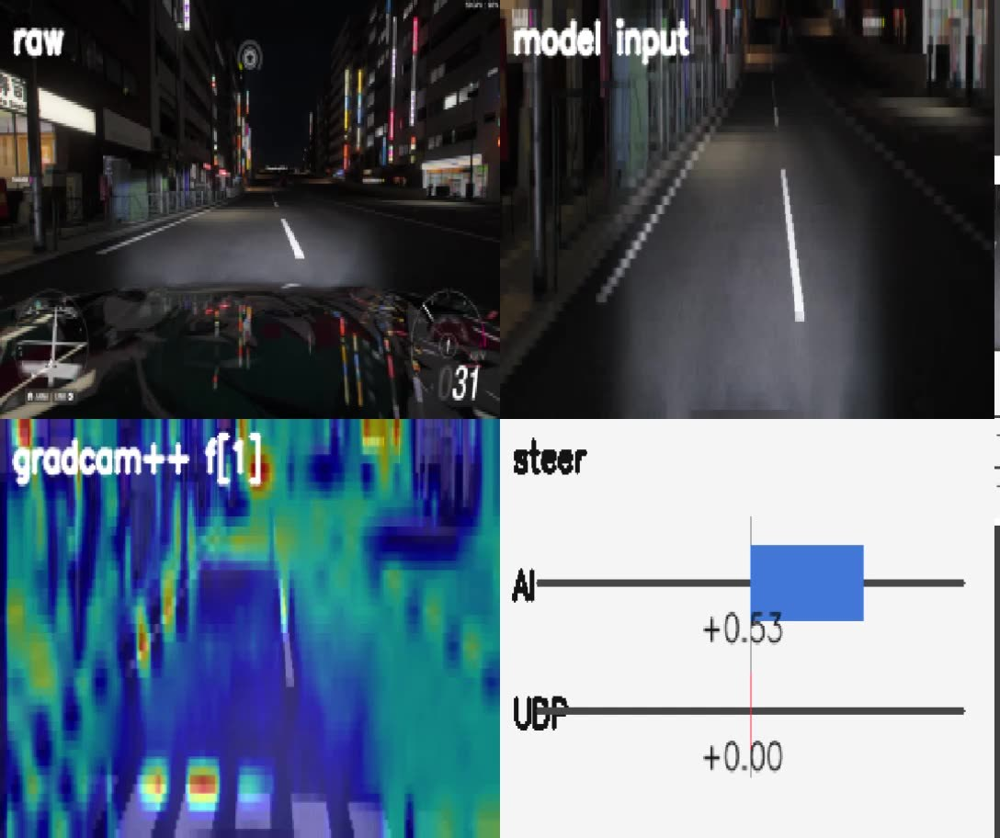
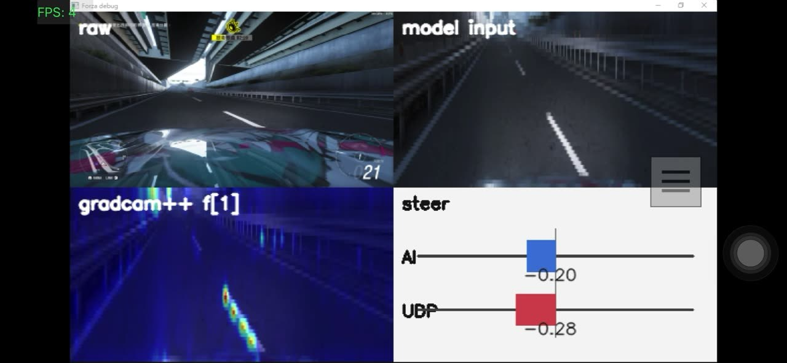
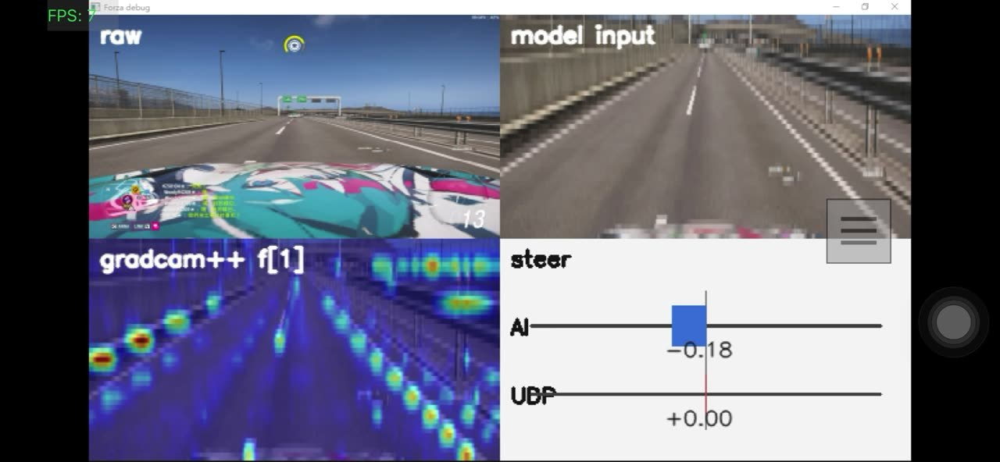
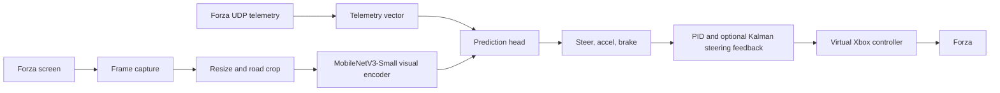
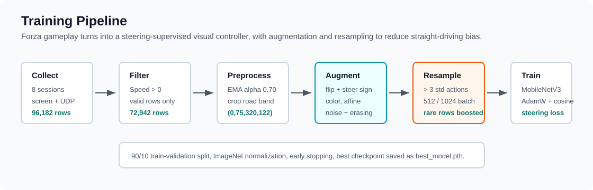
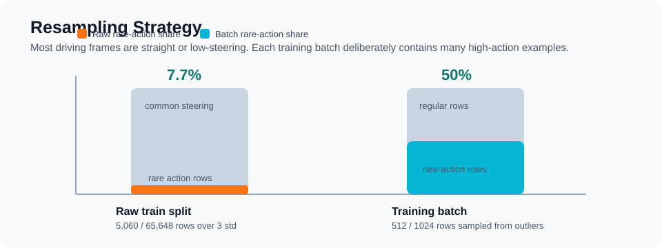
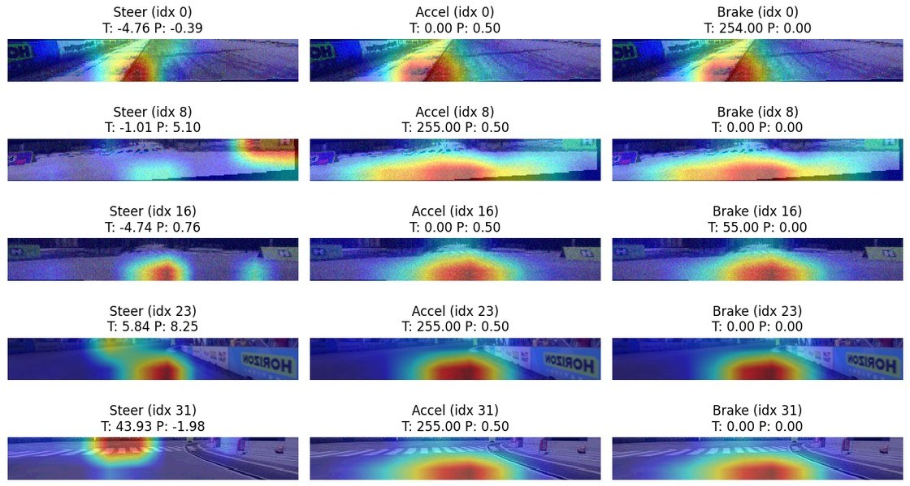

# End2End Autodrive Image-Steer

[English README](README.md)

這是一個以 Forza 為資料收集與測試環境的 image-to-steering imitation learning 專案：用遊戲快速收集駕駛影像與遙測資料，訓練端到端視覺控制模型，再透過虛擬 Xbox 控制器與方向盤回饋在遊戲中即時駕駛。

<p align="center">
  <a href="docs/assets/live-debug.mp4">
    
  </a>
</p>

<p align="center">
  <a href="docs/assets/live-debug.mp4">觀看 9 秒 live debug 片段</a>
</p>

## 為什麼用遊戲

真實自駕資料昂貴、難標註，也很難在相同條件下重複實驗。賽車遊戲提供一個實用的學術沙盒：豐富視覺場景、不同光線、賽道幾何、輪胎極限、遙測資料，以及快速重置。

這個專案利用遊戲做 supervised end-to-end driving。目標不是宣稱從遊戲畫面就能直接做真實道路自駕，而是把資料收集做得更快、更安全、更可重複，同時保留足夠複雜的控制問題來研究 image-to-action policy。

Sony AI 的 GT Sophy 是重要動機：Nature 論文展示了 Gran Turismo 中的深度強化學習 agent 可以處理非線性賽車控制與多人競速策略，甚至達到冠軍級表現。本 repo 探索的是一個比較小但相關的問題：如果把遊戲當成資料引擎，一個實用的影像轉方向盤 pipeline 可以做到什麼程度？

## 研究脈絡

| 年份 | 工作 | 與本專案的關係 |
| --- | --- | --- |
| 1984 | CMU Navlab | Navlab 開啟了長期的相機式自動與輔助駕駛研究路線。 |
| 2004 | DAVE | 小型越野機器人使用相機輸入與端到端學習，從人類駕駛資料預測方向盤。 |
| 2016 | NVIDIA End to End Learning for Self-Driving Cars | CNN 從前視相機 raw pixels 直接輸出 steering；作者也觀察到模型在沒有道路輪廓標註下，自己學到有用的道路特徵。 |
| 2022 | Sony AI GT Sophy | Gran Turismo 中的深度強化學習證明賽車遊戲能支撐高性能、複雜規則下的控制研究。 |
| 2026 | This repo | 使用 Forza 建立快速資料收集與端到端 image steering 評估迴圈。 |

## Demo Clips

以下是從本機錄影剪出的 GitHub-safe 無聲短片。原始大影片保留在本機 `media/`，不進 Git。

| Live Debug | Long Run | Short Control |
| --- | --- | --- |
| <a href="docs/assets/live-debug.mp4"></a> | <a href="docs/assets/long-run.mp4"></a> | <a href="docs/assets/short-control.mp4"></a> |
| [MP4](docs/assets/live-debug.mp4) | [MP4](docs/assets/long-run.mp4) | [MP4](docs/assets/short-control.mp4) |

## 系統架構



Runtime 會擷取遊戲畫面，套用與訓練時一致的 resize、crop 與 ImageNet normalization；如果 checkpoint 需要 telemetry，會將視覺特徵與遙測資料融合，最後透過 `vgamepad` 送出方向盤控制。Live debug window 會顯示 raw frame、model input、Grad-CAM++ overlay，以及 AI steering 和 UDP steering 的對照。

Runtime steering 在這裡被刻意當成 feedback-control 問題，而不是「模型輸出多少，車子就線性轉多少」。模型預測的是 normalized steering target，但 virtual Xbox stick 本身有小 deadzone，遊戲也會套自己的 input response curve；真正車輛反應還會受到速度、抓地力、打滑與賽道路面的非線性影響。再加上目前視覺模型還不是很穩健，離開熟悉資料分布時可能會抖動或修正不足。所以 live loop 會用 `--steer-scale` 放大/縮小模型 target，對實際送出的 stick command 做 smoothing，讓太小的 command 通過 controller deadzone 歸零，並用 PID 對 Forza UDP `Steer` 做閉迴路修正。Optional Kalman filter 則是在 PID 前先把 UDP steering measurement 濾得穩一點。實務上 PID/Kalman 不是裝飾，而是把不完美 imitation model 接到可玩的 closed-loop controller 中間那一層。

核心檔案：

- `forza_autodrive/drive.py`: live inference loop、debug window、hotkeys、controller output
- `forza_autodrive/model.py`: MobileNetV3-Small backbone 與 steering head
- `forza_autodrive/preprocess.py`: capture、resize、crop、normalization
- `forza_autodrive/telemetry.py`: Forza Dash UDP parser
- `forza_autodrive/controller.py`: virtual Xbox output、steering deadzone 與 command smoothing
- `forza_autodrive/steering_control.py`: PID correction、correction limiting、rate limiting 與 optional scalar Kalman filtering
- `load_data.ipynb`: training、validation plots、prediction inspection、Grad-CAM/Score-CAM analysis

## 訓練、資料擴增與重採樣

Training notebook 的核心問題很實際：收集到的大部分駕駛畫面都是直線或小角度 steering，但模型在實際控制時需要看過足夠多的左彎、右彎、修正與高曲率案例，才不會只學到「一直直走」。

<p align="center">
  
</p>

資料集與前處理：

- 從 8 個錄製 session 的 `dataset.csv` 載入資料。
- 96,182 筆 raw rows 經過 `Speed > 0` 與 `is_valid == 1` 過濾後，留下 72,942 筆有效移動資料。
- Steering label 使用 EMA 平滑，`alpha=0.70`。
- 使用固定 seed 做 90/10 train/validation split。
- 影像 resize 後裁切到專注路面的 `(0, 75, 320, 122)`，再套用 ImageNet normalization。

資料擴增的目的，是讓 visual policy 不要只記住單一錄影分布。Dataset 會做 horizontal flip 並同步把 steering 正負號反轉，也會加入 brightness/contrast jitter、小角度 rotation、affine translation/scale、grayscale、invert、posterize、solarize、sharpness、autocontrast、equalize、random erasing 與 Gaussian noise。

<p align="center">
  
</p>

自訂的 `StdOutlierActionBatchSampler` 會把 action value 距離 train-set mean 超過 `3 std` 的 row 標成 high-action examples。這些資料只佔 train split 的 7.7%（`5,060 / 65,648`），但每個 1,024 筆的 training batch 會刻意抽 512 筆來自這個 high-action group。這樣左/右修正與彎道資料在訓練中出現的頻率，就不會被大量直線資料淹沒。

目前 checkpoint path 使用 MobileNetV3-Small visual backbone，搭配 AdamW、warmup、cosine restarts、early stopping，以及 steering-only weighted MSE。較大的絕對 steering target 會被賦予更高權重。Notebook 中 accel/brake loss 目前是註解掉的；runtime 這條路徑會固定 accel/brake output，主要學習 steering。

和 NVIDIA DAVE-2 / end-to-end driving 的對照：

| 面向 | 相同想法 | 本 repo 的做法 |
| --- | --- | --- |
| Supervision | 從 pixels 與人類/駕駛指令學 steering。 | 從 Forza screen capture 與錄下的 controller/telemetry labels 學 steering。 |
| Preprocessing | 使用道路相關視覺輸入，而不是先手工標註 lane。 | 裁切遊戲畫面下方 road band，並使用 ImageNet statistics normalization。 |
| Augmentation | NVIDIA 用 shifted/rotated views 與修正後 steering labels 來訓練 recovery。 | 本 repo 使用影像資料擴增，加上 horizontal flip 與 steering sign inversion。 |
| Imbalance | 因為直線資料佔多數，彎道與 recovery case 需要被特別強化。 | 超過 `3 std` 的 rare action rows 從 train rows 的 7.7% 被提升到每個 batch 的 50%。 |
| Vehicle interface | NVIDIA 從真實道路車輛 CAN bus 收 steering，並用 `1/r` turning curvature 當 target。 | 本 repo 使用 Forza 資料、平滑後 steering labels、遊戲 telemetry、PID/Kalman feedback 與 virtual Xbox controller。 |

NVIDIA 原始的 training 與 architecture figures 請看 [paper](https://arxiv.org/abs/1604.07316) 與 [PDF](https://images.nvidia.com/content/tegra/automotive/images/2016/solutions/pdf/end-to-end-dl-using-px.pdf)。這份 README 的圖是從本 repo notebook 統計資料產生的原創 diagram，沒有複製外部圖片。

## 可解釋性觀察

Notebook 中包含訓練後 steering model 的 Score-CAM/Grad-CAM 類型檢查。

最後層 attention 比較偏高階、區域也比較粗：

<p align="center">
  
</p>

淺層 attention 更局部，反覆打在路面紋理、車道線、護欄與賽道邊界：

<p align="center">
  
</p>

這和 NVIDIA 端到端自駕論文中的觀察相呼應：只用 steering supervision，CNN 也可能學到道路相關內部特徵，而不是必須先明確標註 lane 或 road outline。在這個 repo 中，這只是對 Forza 模型注意區域的定性 sanity check，不是因果性的正式證明。

## Quick Start

### 1. Runtime setup

先安裝 runtime dependencies。PyTorch 指令可依你的 CUDA 版本調整。

```powershell
py -m pip install torch torchvision numpy pillow opencv-python dxcam keyboard vgamepad pytorch-grad-cam
```

Windows live control 需要安裝或修復 ViGEmBus driver，`vgamepad` 才能建立虛擬 Xbox 360 controller。

### 2. 放置模型權重

Checkpoint 檔案大於一般 GitHub repo 適合追蹤的大小，所以預設忽略。請把本機權重放在：

```text
best_model.pth
```

### 3. 啟用 Forza telemetry

在 Forza 開啟 Data Out，使用 Dash format，並把 UDP 封包送到這台電腦：

```text
Host: 127.0.0.1 或你的 PC IP
Port: 9999
Format: Dash
```

### 4. 先 dry-run

這會執行 inference 與 debug window，但不控制虛擬手把。

```powershell
py -m forza_autodrive.drive --model best_model.pth --no-controller --debug-window
```

### 5. Live driving

確認遊戲視窗、telemetry 與 emergency stop 都正常後再使用。

```powershell
py -m forza_autodrive.drive --model best_model.pth --start-armed
```

Hotkeys:

- `F9`: arm/disarm AI control
- `F8`: emergency stop
- `Ctrl+C`: exit and reset controller

常用選項：

```powershell
py -m forza_autodrive.drive --steer-scale 2.0 --steer-feedback pid --steer-kalman --fps 30
```

Steering feedback 調參通常先從 `--steer-scale` 開始，因為模型 target 和遊戲內 stick response 不是一對一線性關係。如果車子吃不到小修正，可能是 scale 太低，或 command 還在 gamepad/game deadzone 裡；如果車身開始左右震盪，可以降低 `--steer-scale`、降低 PID gains、降低 `--steer-pid-correction-limit`，或開 `--steer-kalman` 讓 PID 看到比較不吵的 UDP steering measurement。當模型平均方向是對的、但 frame-to-frame 太抖時，`--steer-smoothing` 和 `--steer-pid-correction-rate-limit` 會比較有幫助。

## README Asset Workflow

原始錄影 `media/` 和模型 checkpoint 都刻意忽略。要發布到 README，只追蹤壓縮後的小素材：

```powershell
py -m pip install -r requirements-readme-assets.txt
py tools/export_readme_assets.py
```

Exporter 會：

- 從 `media/` 剪短無聲 clips
- 移除每段選取片段的尾端，並避開每個 source recording 的最後 1 秒
- 讓 MP4 目標小於 10 MiB
- 輸出小於 500 KiB 的 poster JPG
- 從 `load_data.ipynb` 擷取 compact Score-CAM montages

GitHub 一般 Git repo 中超過 50 MiB 會警告，超過 100 MiB 會被阻擋，所以 `media/` 與 `*.pth` 保留本機，除非改用 Releases 或 Git LFS 發布。

## References

- [CMU Navlab](https://www.cs.cmu.edu/afs/cs/project/alv/www/)
- [DAVE: Autonomous Off-Road Vehicle Control using End-to-End Learning](https://cs.nyu.edu/~yann/research/dave/)
- [NVIDIA: End to End Learning for Self-Driving Cars](https://arxiv.org/abs/1604.07316)
- [NVIDIA paper PDF](https://images.nvidia.com/content/tegra/automotive/images/2016/solutions/pdf/end-to-end-dl-using-px.pdf)
- [Sony AI GT Sophy announcement](https://ai.sony/news/sonyai009)
- [Nature: Outracing champion Gran Turismo drivers with deep reinforcement learning](https://www.nature.com/articles/s41586-021-04357-7)
- [GitHub Docs: About large files on GitHub](https://docs.github.com/en/repositories/working-with-files/managing-large-files/about-large-files-on-github)
