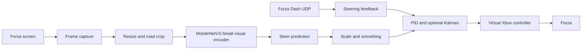
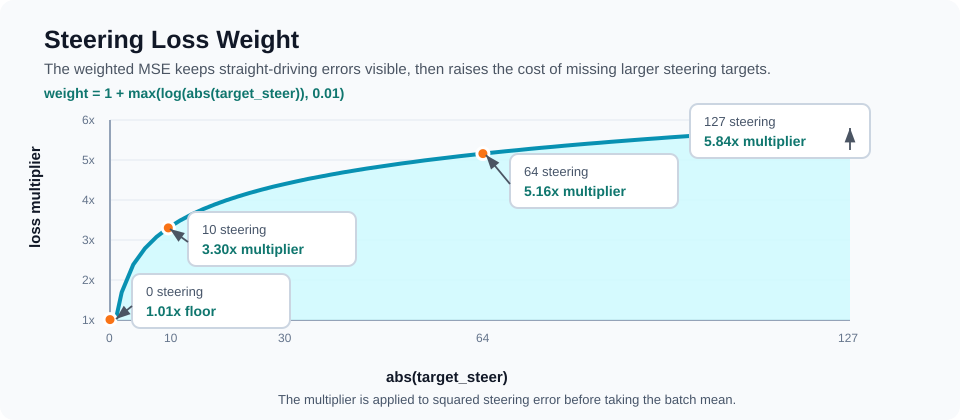

# End2End Autodrive Image-Steer

[](https://github.com/ricky5932TW/End2End-autodrive-image-steer/stargazers)


[English README](README.md)

這是一個以 Forza 為資料收集與測試環境的 image-to-steering imitation learning 專案。它用遊戲畫面與駕駛資料訓練端到端方向盤模型，再透過虛擬 Xbox 控制器、Forza Dash UDP telemetry、PID 與可選 Kalman 濾波，在遊戲中做即時閉迴路控制。

這版 README 依照重新規劃後的資料集與重新訓練 notebook 改寫。舊版文件與舊素材保留在 `old/` 作為封存；目前公開文件只連到根目錄與 `docs/assets/`。

<p align="center">
  <a href="docs/assets/demo-freeway.mp4">
    
  </a>
</p>

<p align="center">
  <a href="docs/assets/demo-freeway.mp4">開啟 freeway demo MP4</a>
</p>

## 為什麼用遊戲

真實自駕資料昂貴、難標註，也很難在相同條件下重複實驗。賽車遊戲提供一個實用的學術沙盒：豐富視覺場景、不同光線、賽道幾何、輪胎極限、遙測資料，以及快速重置。

這個專案使用 Forza 做 supervised end-to-end driving，讓資料收集更快、更安全、更可重複，同時保留足夠複雜的控制問題來研究 image-to-action policy。Sony AI 的 GT Sophy 是重要動機：Gran Turismo 中的深度強化學習 agent 顯示賽車遊戲能支撐高性能控制研究。本 repo 探索的是比較小但可實作的問題：用遊戲當資料引擎，影像轉方向盤的 pipeline 可以做到什麼程度？

## 研究脈絡

| 年份 | 工作 | 與本專案的關係 |
| --- | --- | --- |
| 1984 | CMU Navlab | 開啟相機式自動與輔助駕駛研究路線。 |
| 2004 | DAVE | 小型越野機器人使用相機輸入與端到端學習，從人類駕駛資料預測方向盤。 |
| 2016 | NVIDIA End to End Learning for Self-Driving Cars | CNN 從前視相機 raw pixels 直接輸出 steering；本 repo 沿用 image-to-steering 的 supervised learning 思路。 |
| 2022 | Sony AI GT Sophy | Gran Turismo 中的深度強化學習證明賽車遊戲能承載複雜控制研究。 |
| 2026 | This repo | 使用 Forza 建立資料收集、重採樣訓練、可視化檢查與 live control 評估迴圈。 |

## 示範片段

以下是從目前 `media/` 內新錄影剪出的 GitHub-safe 無聲短片。GIF 預覽可直接在 README 顯示；點縮圖或 MP4 連結可開啟原始短片。

| Freeway | Mountain | Unpaved |
| --- | --- | --- |
| <a href="docs/assets/demo-freeway.mp4"></a> | <a href="docs/assets/demo-mountain.mp4"></a> | <a href="docs/assets/demo-unpaved.mp4"></a> |
| [開啟 MP4](docs/assets/demo-freeway.mp4) | [開啟 MP4](docs/assets/demo-mountain.mp4) | [開啟 MP4](docs/assets/demo-unpaved.mp4) |

| Night | Long range |
| --- | --- |
| <a href="docs/assets/demo-night.mp4"></a> | <a href="docs/assets/demo-longrange.mp4"></a> |
| [開啟 MP4](docs/assets/demo-night.mp4) | [開啟 MP4](docs/assets/demo-longrange.mp4) |

## 系統架構



Runtime 會擷取遊戲畫面，套用與訓練一致的 resize、road crop 與 ImageNet normalization。新版 checkpoint 是 image-only steering model，notebook 中 `telemetry_dim=0`；Forza UDP 仍用在 live 狀態顯示、速度/封包檢查，以及把 UDP `Steer` 當作 PID feedback measurement。

核心檔案：

- `training_data.py`: 掃描 session、載入 `dataset.csv`、過濾有效移動資料、套用 steering EMA。
- `load_data.ipynb`: dataset planning、augmentation、balanced sampler、training、loss plots、CAM 檢查。
- `forza_autodrive/model.py`: MobileNetV3-Small visual backbone 與 steering head。
- `forza_autodrive/preprocess.py`: capture、resize、crop、normalization。
- `forza_autodrive/drive.py`: live inference loop、debug window、hotkeys、controller output。
- `forza_autodrive/telemetry.py`: Forza Dash UDP parser。
- `forza_autodrive/controller.py`: virtual Xbox output、deadzone 與 smoothing。
- `forza_autodrive/steering_control.py`: PID correction、rate limiting 與 optional scalar Kalman filtering。

## 訓練、資料擴增與重採樣

新版 notebook 的核心目標是重新規劃資料集：把資料來源集中到 `sessions/`，用新的 driving clips 取代舊資料分布，並調整 rare-action sampling，讓模型更常看到修正、轉彎與高動作案例。

<p align="center">
  
</p>

資料集與前處理：

- 從 `sessions/` 下 12 個 `dataset.csv` image session 載入資料。
- 52,697 筆 raw rows 經過 `Speed > 0` 與 `is_valid == 1` 過濾後，留下 52,015 筆有效移動資料。
- Steering label 使用 EMA 平滑，`alpha=0.70`；notebook 輸出顯示 mean `|delta|=0.503`，raw std `13.335`，filtered std `12.972`。
- 使用固定 seed 做 90/10 train/validation split：46,814 train rows、5,201 validation rows。
- 影像 resize 到 320x180 後，依 1080p 參考高度裁切 road band：`(0,75,320,122)`，輸入 tensor 為 `3x47x320`。
- 目前訓練是 image-only path，`TELEMETRY_COLUMNS=()`，`telemetry_dim=0`。

資料擴增的目的，是讓 visual policy 不只記住單一錄影分布。Dataset 會做 horizontal flip 並同步反轉 steering sign，也會加入 brightness/contrast jitter、小角度 rotation、affine translation/scale、grayscale、invert、posterize、solarize、sharpness、autocontrast、equalize、random erasing 與 Gaussian noise。

<p align="center">
  
</p>

`StdOutlierActionBatchSampler` 會把任一 action value 距離 train-set mean 超過 `1 std` 的 row 標成 outlier examples。這些資料佔 train split 的 16.2%（`7,583 / 46,814`），但每個 1,024 筆 training batch 會抽 512 筆來自 outlier group。這樣轉彎、修正、油門與煞車變化較大的資料，在訓練中不會被大量穩定巡航畫面淹沒。

目前 active objective 是 steering-only weighted MSE：

```text
steer_loss = mean((pred_steer - target_steer)^2 * weight)
weight = 10 ** (abs(target_steer) / 127)
```

這個權重在 steering 接近 0 時是 `1.00x`，在 full steering `127` 時提高到 `10.00x`。相較於舊版 log-weight，這版更直接把大角度 steering miss 的成本拉高。

<p align="center">
  
</p>

模型使用 MobileNetV3-Small backbone、AdaptiveAvgPool2d `(4,12)`、1024 hidden head、LayerNorm、SiLU、Dropout，最後以 `tanh` 輸出 `[-127,127]` steering。Optimizer 使用 AdamW、warmup、CosineAnnealingWarmRestarts 與 early stopping。Notebook 顯示訓練在 epoch 477 附近被手動中斷；最後可見較佳 validation steer loss 是 epoch 476 的 `72.8778`，因此這裡只把它視為目前 checkpoint 狀態，不宣稱完整收斂。

`accel=0.5`、`brake=0.0` 是 steering-only runtime path 的 placeholder output；目前沒有把油門/煞車 loss 放進 active objective。

## 可解釋性觀察

Notebook 內保留 Grad-CAM/Score-CAM 類型檢查，用來確認模型是否把注意力放在道路紋理、車道線、護欄、賽道邊界與彎道線索上。

最後層 attention 比較偏高階、區域也較粗：

<p align="center">
  
</p>

淺層 attention 更局部，會反覆打在道路標線與邊界附近：

<p align="center">
  
</p>

這和 NVIDIA 端到端自駕論文中的觀察相呼應：即使只用 steering supervision，CNN 也可能從駕駛資料中學到道路相關內部特徵。對這個 repo 來說，CAM 主要是 qualitative sanity check。

## Quick Start

### 1. Runtime setup

先安裝 runtime dependencies。

> [!NOTE]
> PyTorch wheel 需要依本機 CUDA 或 CPU 環境選擇；下方指令是簡化版 pip 安裝起點。

```powershell
py -m pip install torch torchvision numpy pillow opencv-python dxcam keyboard vgamepad pytorch-grad-cam
```

Windows live control 需要安裝或修復 ViGEmBus driver，`vgamepad` 才能建立虛擬 Xbox 360 controller。

### 2. 放置模型權重

Checkpoint 檔案大，應透過 Git LFS 發布；如果 clone 後沒有權重檔，請確認已安裝 Git LFS 並執行 `git lfs pull`。Runtime 預設會讀取：

```text
best_model.pth
```

### 3. 啟用 Forza telemetry

在 Forza 開啟 Data Out，使用 Dash format，並把 UDP 封包送到這台電腦：

```text
Host: 127.0.0.1 或你的 PC IP
Port: 9999
Format: Dash
```

### 4. 先 dry-run

這會執行 inference 與 debug window，但不控制虛擬手把。

```powershell
py -m forza_autodrive.drive --model best_model.pth --no-controller --debug-window
```

### 5. Live driving

> [!CAUTION]
> 啟動 live control 前，請先確認 telemetry 持續更新、Forza 視窗焦點正確、virtual controller 狀態可預期，而且 `F8` emergency stop 可用。

```powershell
py -m forza_autodrive.drive --model best_model.pth --start-armed
```

Hotkeys:

- `F9`: arm/disarm AI control
- `F8`: emergency stop
- `Ctrl+C`: exit and reset controller

常用 PID/Kalman steering feedback 選項：

```powershell
py -m forza_autodrive.drive --model best_model.pth --steer-scale 2.0 --steer-feedback pid --steer-kalman --fps 30
```

調參通常先從 `--steer-scale` 開始。如果小修正吃不到，可能是 scale 太低或仍在 controller/game deadzone 裡；如果車身左右震盪，可以降低 `--steer-scale`、降低 PID gains、降低 `--steer-pid-correction-limit`，或開 `--steer-kalman` 讓 PID 看到較穩的 UDP steering measurement。

## README Asset Workflow

原始錄影 `media/`、notebook、README 素材與模型 checkpoint 都屬於大型/二進位 artifact，應透過 Git LFS 發布。要重新產生 README 內的小素材，使用：

```powershell
py -m pip install -r requirements-readme-assets.txt
py tools/export_readme_assets.py
```

Exporter 會：

- 從目前 `media/` 剪出 `demo-freeway`、`demo-mountain`、`demo-unpaved`、`demo-night`、`demo-longrange`。
- 輸出 GitHub-safe MP4、GIF preview 與 poster JPG。
- 從 `load_data.ipynb` 擷取 compact CAM montages。
- 產生新版 training pipeline、resampling balance 與 loss weight curve SVG。

GitHub 一般 Git repo 中超過 50 MiB 會警告，超過 100 MiB 會被阻擋，所以 `media/`、`*.pth`、`*.ipynb`、影片、GIF 與 JPG 都應維持在 Git LFS track 規則下。

## References

- [CMU Navlab](https://www.cs.cmu.edu/afs/cs/project/alv/www/)
- [DAVE: Autonomous Off-Road Vehicle Control using End-to-End Learning](https://cs.nyu.edu/~yann/research/dave/)
- [NVIDIA: End to End Learning for Self-Driving Cars](https://arxiv.org/abs/1604.07316)
- [NVIDIA paper PDF](https://images.nvidia.com/content/tegra/automotive/images/2016/solutions/pdf/end-to-end-dl-using-px.pdf)
- [Sony AI GT Sophy announcement](https://ai.sony/news/sonyai009)
- [Nature: Outracing champion Gran Turismo drivers with deep reinforcement learning](https://www.nature.com/articles/s41586-021-04357-7)
- [GitHub Docs: About large files on GitHub](https://docs.github.com/en/repositories/working-with-files/managing-large-files/about-large-files-on-github)
